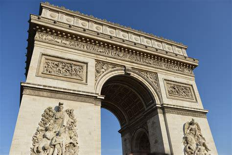
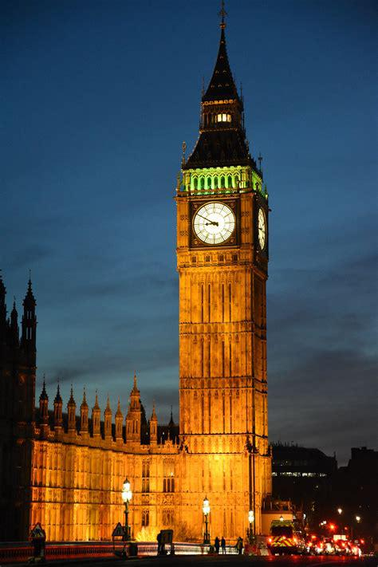
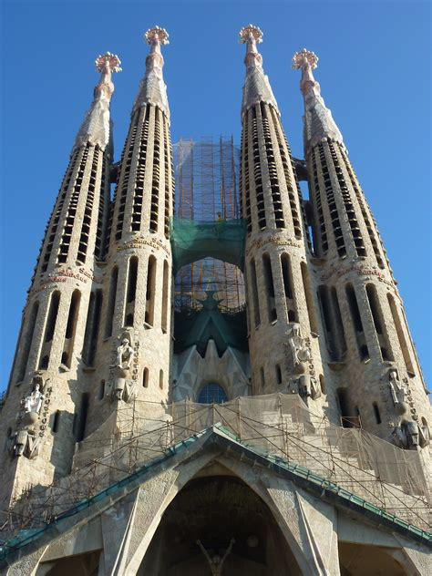
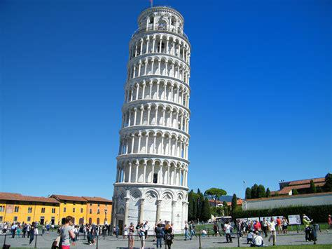
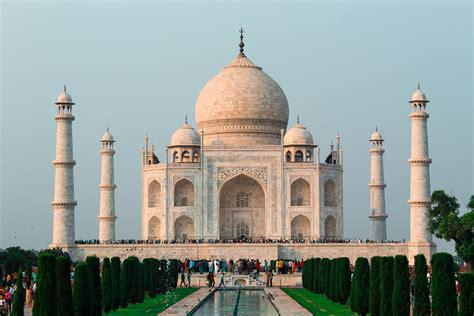

---
tags:
- image-classification
- pytorch
- huggingpics
metrics:
- accuracy

model-index:
- name: vit-world-landmarks
  results:
  - task:
      name: Image Classification
      type: image-classification
    metrics:
      - name: Accuracy
        type: accuracy
        value: 1.0
---

# vit-world-landmarks

Autogenerated by HuggingPics🤗🖼️

Create your own image classifier for **anything** by running [the demo on Google Colab](https://colab.research.google.com/github/nateraw/huggingpics/blob/main/HuggingPics.ipynb).

Report any issues with the demo at the [github repo](https://github.com/nateraw/huggingpics).

## Example Images

#### arc de triomphe

#### big ben

#### la sagrada familia

#### leaning tower of pisa

#### taj mahal

